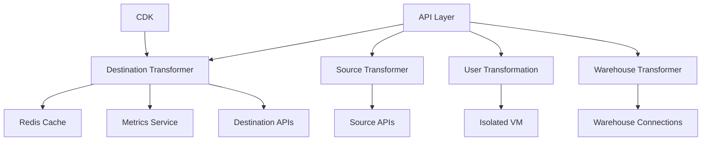
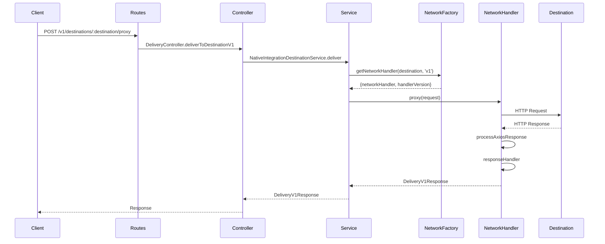

# System Architecture

## Components

### Destination Transformer

Transforms events from RudderStack format to destination-specific formats. Handles both processor and router transformation modes.

**Key responsibilities:**

- Convert event data to destination-specific format
- Apply destination-specific validation rules
- Handle rate limiting and batching requirements
- Process responses from destinations

### Source Transformer

Transforms data from external sources into [RudderStack's standard event](https://www.rudderstack.com/docs/event-spec/standard-events/) format.

**Key responsibilities:**

- Parse incoming data from various sources
- Normalize data to RudderStack's event schema
- Handle source-specific authentication
- Validate incoming data

### User Transformation

Allows custom transformations through user-defined functions executed in a sandboxed environment.

**Key responsibilities:**

- Execute user-provided JavaScript code safely
- Apply custom transformations to events
- Provide isolation between user code and system code
- Handle errors in user transformations

### Warehouse Transformer

Specialized transformer for data warehouse destinations with specific formatting requirements.

**Key responsibilities:**

- Format data for warehouse destinations
- Handle schema management
- Apply type conversions
- Manage batching for efficient loading

### API Layer

Koa.js based REST API that exposes transformation endpoints for processor, router, and batch operations.

**Key responsibilities:**

- Handle HTTP requests and responses
- Route requests to appropriate services
- Apply middleware for authentication, logging, etc.
- Provide Swagger documentation

### Metrics Service

Collects and exposes metrics about transformation operations using Prometheus.

**Key responsibilities:**

- Track performance metrics
- Monitor error rates
- Provide insights into system health
- Support alerting and dashboards

### Redis Cache

Used for caching and temporary storage of transformation data.

**Key responsibilities:**

- Cache frequently used data
- Store temporary transformation results
- Support distributed operations
- Provide fast access to shared data

### CDK (Component Development Kit)

Framework for developing new destination integrations in a standardized way.

**Key responsibilities:**

- Provide templates for new integrations
- Standardize integration development
- Simplify maintenance and updates
- Ensure consistent behavior across integrations

## Relationships



## Data Flow

1. **Event Ingestion**:

   - Events are received through the API layer
   - Events are validated and preprocessed

2. **Transformation**:

   - Events are routed to appropriate transformer
   - Transformer applies destination-specific logic
   - User transformations are applied if configured

3. **Delivery**:

   - Transformed events are sent to destinations
   - Destination responses are parsed and converted to standard HTTP status codes
   - Response parsing enables rudder-server to handle responses appropriately:
     - 500 and 429 status codes trigger retries
     - 400 status codes cause events to be aborted
   - Proxy v1 implementation provides granular handling of partial batch failures
   - Individual events in a batch can be marked for retry or abort independently
   - Metrics are collected and logged

4. **Error Handling**:
   - Errors are captured and logged
   - Retry logic is applied when appropriate
   - Error metrics are collected

## Proxy V1 Architecture

The proxy v1 implementation in rudder-transformer follows a layered architecture that enables sophisticated handling of batch requests and partial failures.

### Request Flow



### Component Interactions

1. **Routes Layer**:

   - Defined in `src/routes/delivery.ts`
   - Handles routing of proxy v1 requests to `/v1/destinations/:destination/proxy`
   - Applies middleware for route activation and request filtering

2. **Controller Layer**:

   - Implemented in `src/controllers/delivery.ts`
   - `DeliveryController.deliverToDestinationV1` processes proxy v1 requests
   - Uses `ServiceSelector` to get the appropriate service
   - Handles errors using `DestinationPostTransformationService`

3. **Service Layer**:

   - Implemented in `src/services/destination/nativeIntegration.ts`
   - `NativeIntegrationDestinationService.deliver` handles delivery of proxy v1 requests
   - Uses `networkHandlerFactory` to get the appropriate network handler
   - Adapts v0 responses to v1 format if necessary

4. **Network Handler Factory**:

   - Implemented in `src/adapters/networkHandlerFactory.js`
   - Selects the appropriate network handler for a destination
   - Falls back to v0 handlers if no v1 handler is found
   - Falls back to a generic handler if no specific handler is found

5. **Destination-Specific Network Handlers**:
   - Implemented in `src/v1/destinations/{destination}/networkHandler.js` or `.ts`
   - Implement methods for preparing requests, sending requests, and handling responses
   - Many use the Strategy pattern to handle different types of responses
   - Handle partial batch failures by processing each event individually

### Adaptation Between V0 and V1

The system includes adaptation logic to handle cases where a v1 request is processed by a v0 handler:

```typescript
// Adaption Logic for V0 to V1
if (handlerVersion.toLowerCase() === 'v0' && version.toLowerCase() === 'v1') {
  const v0Response = responseProxy as DeliveryV0Response;
  const jobStates = (deliveryRequest as ProxyV1Request).metadata.map(
    (metadata) =>
      ({
        error: JSON.stringify(v0Response.destinationResponse?.response),
        statusCode: v0Response.status,
        metadata,
      }) as DeliveryJobState,
  );

  responseProxy = {
    response: jobStates,
    status: v0Response.status,
    message: v0Response.message,
    authErrorCategory: v0Response.authErrorCategory,
  } as DeliveryV1Response;
}
```

This adaptation ensures backward compatibility with destinations that only have v0 handlers.

## Scaling Architecture

The transformer is designed to scale horizontally:

- **Clustering**: Multiple instances can run in parallel
- **Stateless Design**: No shared state between instances
- **Redis**: Used for coordination between instances
- **Load Balancing**: Requests can be distributed across instances

## Integration with RudderStack

The transformer is a critical component in the RudderStack data pipeline, interacting with several other components:

### rudder-server

- Sends events to rudder-transformer for transformation
- Receives transformed events from rudder-transformer
- Delivers transformed events to destinations

### rudder-ingestion-svc

- Sends source data to rudder-transformer for transformation
- Receives standardized events from rudder-transformer

### rudder-integrations-config

- Provides configuration schemas for destinations and sources
- Defines validation rules and default values for integrations
- Supplies metadata about integrations

The transformer handles these interactions through well-defined APIs:

- Processor transformation API for server-side processing
- Router transformation API for routing events to destinations
- Batch processing API for handling multiple events efficiently
- Source transformation API for converting source data to standard format

For more detailed information about these dependencies and interactions, see the System Dependencies document.
