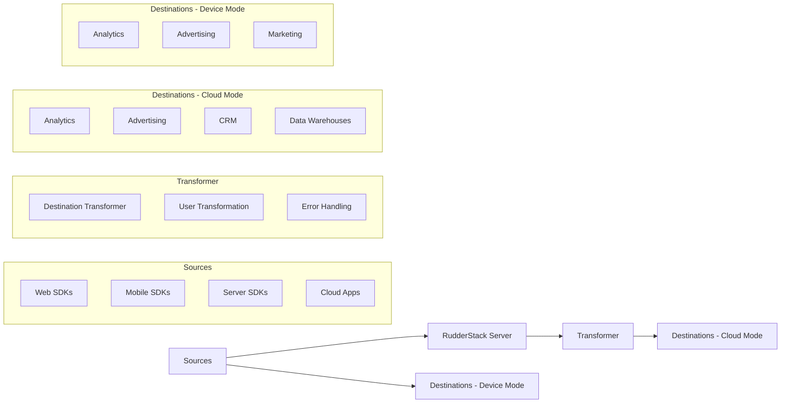

# Event Stream Pipeline

## Overview

RudderStack's Event Stream pipeline is a comprehensive solution for collecting real-time user event data and sending it to integrations across the customer's stack. The RudderStack Transformer is a critical component in this pipeline, responsible for bidirectional transformations:

1. Transforming data from external sources into [RudderStack's standard event](https://www.rudderstack.com/docs/event-spec/standard-events/) format
2. Transforming RudderStack events to destination-specific formats

## Key Components

### Sources

Event Stream can ingest events from:

#### Web SDKs

- **JavaScript** - For websites and web applications
- **AMP** - For Accelerated Mobile Pages

#### Mobile SDKs

- **Android** - Native SDK for Android applications
- **iOS** - Native SDK for iOS applications
- **React Native** - For React Native applications
- **Flutter** - For Flutter applications
- **Unity** - For Unity-based games and applications
- **Cordova** - For Cordova-based hybrid applications
- **Kotlin** - Flagship SDK for Android applications

#### Server SDKs

- **.NET** - For .NET applications
- **Go** - For Go applications
- **Java** - For Java applications
- **Node.js** - For Node.js applications
- **PHP** - For PHP applications
- **Python** - For Python applications
- **Ruby** - For Ruby applications
- **Rust** - For Rust applications

#### Cloud App Sources

- Various cloud applications that can send events to RudderStack, including:
  - Adjust
  - AppsFlyer
  - Auth0
  - Braze
  - Customer.io
  - Iterable
  - Segment
  - Shopify
  - Webhook (for custom sources)

### Transformer

The RudderStack Transformer is responsible for bidirectional transformations:

#### For Sources:

1. **Receiving data** from external sources (webhooks, cloud apps)
2. **Transforming data** into [RudderStack's standard event](https://www.rudderstack.com/docs/event-spec/standard-events/) format
3. **Validating** incoming data against RudderStack's schema
4. **Normalizing** data from different sources

#### For Destinations:

1. **Receiving events** from the RudderStack server
2. **Transforming events** to destination-specific formats
3. **Applying validation rules** specific to each destination
4. **Handling batching** and rate limiting requirements
5. **Processing responses** from destinations

### Destinations

After transformation, events can be sent to 200+ destinations, including:

- **Analytics tools** (Google Analytics, Amplitude, Mixpanel)
- **Advertising platforms** (Facebook Ads, Google Ads)
- **CRM systems** (Salesforce, HubSpot)
- **Customer engagement tools** (Braze, Customer.io)
- **Data warehouses** (Snowflake, BigQuery, Redshift)
- **Custom destinations** (via Webhook)

## Integration Modes

RudderStack supports two primary integration modes:

### Cloud Mode

- Events are sent from the source to the RudderStack server
- The server forwards events to the transformer
- Transformer converts events to destination-specific format
- Transformed events are sent to destinations
- Managed by the Integration Team

### Device Mode

- Events are sent directly from the device to destinations
- Uses native SDK libraries for destinations
- Provides real-time data delivery
- No server-side processing required
- JS SDK device mode integrations are developed by the Integration Team but located in the [rudder-sdk-js](https://github.com/rudderlabs/rudder-sdk-js) repository
- Mobile platform (Android, iOS, etc.) device mode integrations are developed by the SDK Team in various SDK-specific repositories

## Data Flow

1. **Event Collection**:

   - Events are collected from various sources using RudderStack SDKs or cloud app integrations
   - For device mode: events are sent directly to destinations
   - For cloud mode: events are sent to the RudderStack server

2. **Event Processing (Cloud Mode)**:

   - RudderStack server processes the events and sends them to the transformer
   - Transformer applies destination-specific transformations
   - User-defined transformations are applied if configured

3. **Event Delivery**:
   - Device mode: events are delivered directly from the device
   - Cloud mode: transformed events are sent to the specified destinations
   - Responses are processed and logged
   - Errors are handled appropriately

## Advanced Features

### Transformations

RudderStack can transform events in real-time using:

- **Destination-specific transformations**: Built-in transformations for each destination
- **User-defined transformations**: Custom JavaScript or Python code to modify events
- **Tracking plans**: Enforce data structure and consistency

### User Identification

Event Stream supports sophisticated user identification:

- **Anonymous ID**: Assigned to users before identification
- **User ID**: Assigned when a user is identified
- **Identity resolution**: Connect anonymous activities to known users
- **Cross-device tracking**: Track users across multiple devices

### Event Filtering

Events can be filtered at various stages:

- **Client-side filtering**: Filter events before they leave the source
- **Server-side filtering**: Filter events at the RudderStack server
- **Destination-specific filtering**: Send only relevant events to each destination

## Integration with Transformer

The transformer plays a critical role in the Event Stream pipeline:

1. **Destination Compatibility**: Ensures events are formatted correctly for each destination
2. **Data Validation**: Validates events against destination requirements
3. **Error Handling**: Provides detailed error information for troubleshooting
4. **Performance Optimization**: Batches events and handles rate limiting
5. **Extensibility**: Supports custom transformations and new destinations

## Use Cases

### Real-time Analytics

Collect and analyze user behavior data in real-time across multiple platforms.

### Customer Data Infrastructure

Build a unified customer data infrastructure that connects all your tools and systems.

### Data Warehousing

Send clean, structured event data to your data warehouse for analysis and reporting.

### Marketing Automation

Trigger marketing campaigns based on user behavior across channels.

### Product Analytics

Understand how users interact with your product to drive improvements.

### Compliance and Privacy

Manage user consent and ensure compliance with privacy regulations.
