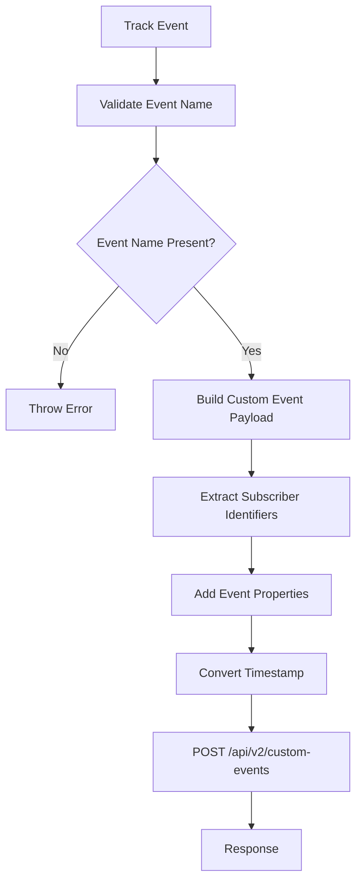
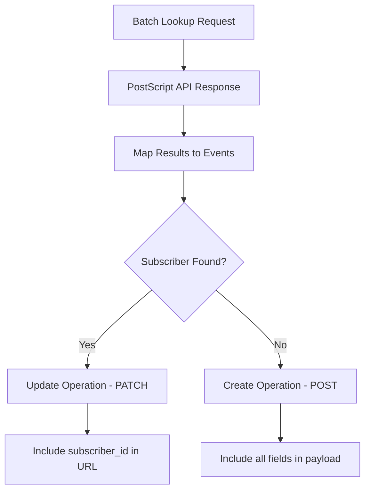

# PostScript Business Logic and Mappings

## Overview

PostScript destination implements SMS marketing functionality with two primary operations:

1. **Subscriber Management** (Identify events) - Create and update subscriber profiles
2. **Custom Event Tracking** (Track events) - Send behavioral events for automation triggers

## Field Mappings

### Subscriber Fields (Identify Events)

The following table shows how RudderStack traits map to PostScript subscriber fields:

| PostScript Field      | RudderStack Source                                               | Required  | Description                                             |
| --------------------- | ---------------------------------------------------------------- | --------- | ------------------------------------------------------- |
| `email`               | `traits.email` or `context.traits.email`                         | No        | Subscriber email address                                |
| `phone_number`        | `traits.phone` or `context.traits.phone`                         | **Yes**   | Subscriber phone number (primary identifier)            |
| `first_name`          | `traits.firstName` or `context.traits.firstName`                 | No        | Subscriber first name                                   |
| `last_name`           | `traits.lastName` or `context.traits.lastName`                   | No        | Subscriber last name                                    |
| `keyword`             | `traits.keyword` or `context.traits.keyword`                     | **Yes\*** | Opt-in keyword for subscription                         |
| `keyword_id`          | `traits.keywordId` or `context.traits.keywordId`                 | **Yes\*** | Opt-in keyword ID for subscription                      |
| `subscriber_id`       | `traits.subscriberId` or `context.traits.subscriberId`           | No        | PostScript subscriber ID (for updates)                  |
| `external_id`         | `traits.externalId` or `context.traits.externalId`               | No        | External system identifier                              |
| `shopify_customer_id` | `traits.shopifyCustomerId` or `context.traits.shopifyCustomerId` | No        | Shopify customer ID (converted to number)               |
| `tags`                | `traits.tags` or `context.traits.tags`                           | No        | Array of tags for subscriber segmentation               |
| `origin`              | `traits.origin` or `context.traits.origin`                       | No        | Source of subscriber acquisition                        |
| `properties`          | Unmapped traits from the event                                   | No        | Custom properties (auto-generated from unmapped traits) |

Either one out of 'keyword' or 'keyword_id' is required.

### Custom Event Fields (Track Events)

| PostScript Field | RudderStack Source                 | Required | Description                  |
| ---------------- | ---------------------------------- | -------- | ---------------------------- |
| `type`           | `message.event`                    | **Yes**  | Event name/type              |
| `subscriber_id`  | External ID or `userId`            | No\*     | PostScript subscriber ID     |
| `external_id`    | External ID                        | No\*     | External system identifier   |
| `email`          | `context.traits.email`             | No\*     | Subscriber email             |
| `phone`          | `context.traits.phone`             | No\*     | Subscriber phone number      |
| `occurred_at`    | `originalTimestamp` or `timestamp` | No       | Event timestamp (ISO format) |
| `properties`     | `message.properties`               | No       | Event properties             |

\*At least one identifier (subscriber_id, external_id, email, or phone) is required for track events. In case no identifier is present, the event definition will still be captured and made available in PostScript Flows.

## Flow of Logic

### Identify Event Processing

```mermaid
graph TD
    A[Identify Event] --> B[Validate Required Fields]
    B --> C{Phone Number Present?}
    C -->|No| D[Throw Error]
    C -->|Yes| E[Build Subscriber Payload]
    E --> F[Extract Custom Properties]
    F --> G{Subscriber ID Present?}
    G -->|Yes| H[Direct Update - PATCH]
    G -->|No| I[Perform Lookup]
    I --> J{Subscriber Exists?}
    J -->|Yes| K[Update - PATCH /subscribers/{id}]
    J -->|No| L[Create - POST /subscribers]
    H --> M[Batch Response]
```

#### Detailed Steps:

1. **Validation**: Check for required phone number field
2. **Payload Building**: Map RudderStack traits to PostScript fields using configuration
3. **Custom Properties Extraction**: Convert unmapped traits to snake_case custom properties
4. **Lookup Decision**:
   - If `subscriber_id` is present → Direct update
   - If no `subscriber_id` → Perform batch lookup by phone number
5. **API Call Routing**:
   - Existing subscriber → `PATCH /api/v2/subscribers/{subscriber_id}`
   - New subscriber → `POST /api/v2/subscribers`

### Track Event Processing



#### Detailed Steps:

1. **Validation**: Ensure event name is present
2. **Payload Building**: Create custom event payload with event type
3. **Identifier Resolution**: Add subscriber identification in priority order:
   - `subscriber_id` (highest priority)
   - `external_id`
   - `userId` (fallback)
   - `email` and `phone` from context traits
4. **Property Mapping**: Include all event properties as-is
5. **Timestamp Conversion**: Convert to ISO format for `occurred_at` field
6. **API Call**: Single `POST` to `/api/v2/custom-events`

## Subscriber Lookup Logic

### Batch Lookup Process

The destination implements an efficient batch lookup mechanism to optimize API calls:

```typescript
// Batch lookup by phone numbers
const phoneNumbers = events.map((event) => event.identifierValue);
const params = new URLSearchParams();
params.append('phone_in', phoneNumbers.join(','));
params.append('limit', '100');

const lookupUrl = `/api/v2/subscribers?${params.toString()}`;
```

### Lookup Results Processing



## Validations

### Identify Event Validations

#### Required Fields

- **Phone Number**: Must be present in `traits.phone` or `context.traits.phone`
- **Keyword or Keyword ID**: Either `keyword` or `keyword_id` should be provided for new subscribers (PostScript requirement)

#### Field Format Validations

- **Phone Number**: Must be in valid international format
- **Email**: Must be valid email format (if provided)
- **Shopify Customer ID**: Converted to number type
- **Tags**: Must be array format (if provided)

#### Business Rules

- For update operations (when `subscriber_id` is present), the `subscriber_id` is removed from payload and used in URL path
- Custom properties are automatically generated from unmapped traits with snake_case conversion
- Context traits take priority over message-level traits

### Track Event Validations

#### Required Fields

- **Event Name**: Must be present in `message.event`
- **Subscriber Identification**: At least one of the following must be present for proper identification:
  - `subscriber_id` (from external IDs)
  - `external_id` (from external IDs)
  - `userId` (fallback identifier)
  - `email` (from context traits)
  - `phone` (from context traits)

#### Field Format Validations

- **Event Name**: Non-empty string
- **Timestamp**: Valid date format for conversion to ISO string
- **Properties**: Must be object type (if provided)

#### Business Rules

- Event properties are included as-is without transformation
- Timestamp conversion prioritizes `originalTimestamp` over `timestamp`
- Multiple identifier types can be provided simultaneously

## Error Handling

### Transformation Errors

- **Missing Required Fields**: Throws `InstrumentationError` with specific field names
- **Invalid Event Type**: Throws `InstrumentationError` for unsupported event types
- **Configuration Errors**: Throws `ConfigurationError` for missing API key

### API Errors

- **Rate Limiting (429)**: Handled by network layer with exponential backoff
- **Authentication (401)**: Returned as non-retryable error
- **Server Errors (5xx)**: Marked as retryable errors
- **Client Errors (4xx)**: Generally non-retryable, returned with error details

### Lookup Failures

- **Graceful Degradation**: If subscriber lookup fails, all identify events are treated as create operations
- **Continued Processing**: Lookup failures don't stop the transformation process
- **Error Logging**: Lookup errors are logged but don't fail the entire batch

## General Use Cases

### SMS Marketing Automation

- **Subscriber Onboarding**: Use identify events to add new subscribers with proper keyword association
- **Profile Enrichment**: Update subscriber profiles with additional attributes over time
- **Behavioral Tracking**: Send track events to trigger automated SMS flows based on customer actions

### E-commerce Integration

- **Shopify Integration**: Link PostScript subscribers with Shopify customers using `shopify_customer_id`
- **Purchase Events**: Track purchase behavior for targeted marketing campaigns
- **Abandoned Cart**: Send cart abandonment events to trigger recovery SMS sequences

### Customer Journey Tracking

- **Multi-channel Attribution**: Use external IDs to connect PostScript data with other marketing platforms
- **Lifecycle Events**: Track key customer lifecycle events (signup, purchase, churn) for segmentation
- **Custom Segmentation**: Use tags and custom properties for advanced subscriber segmentation
